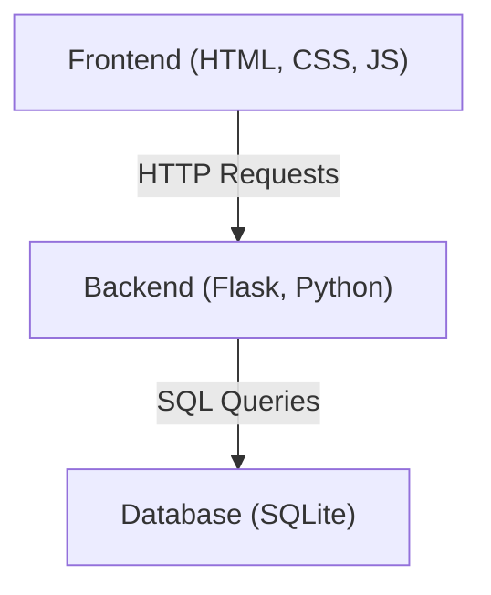
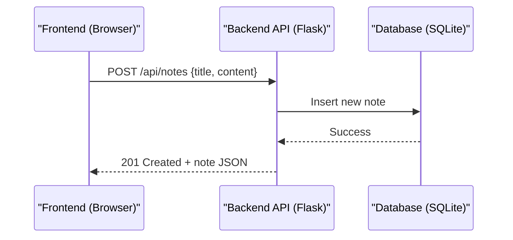
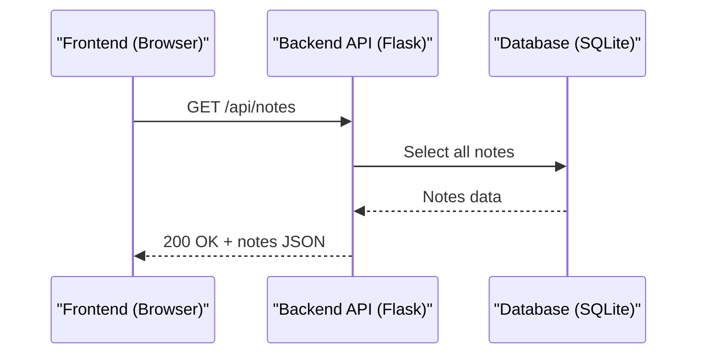
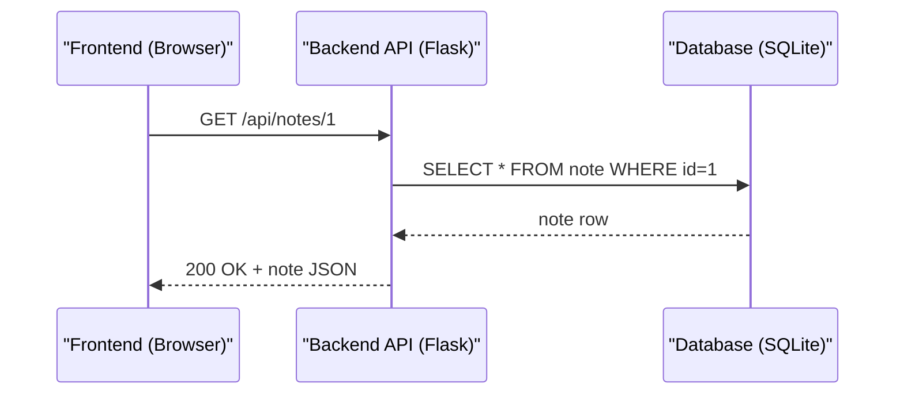
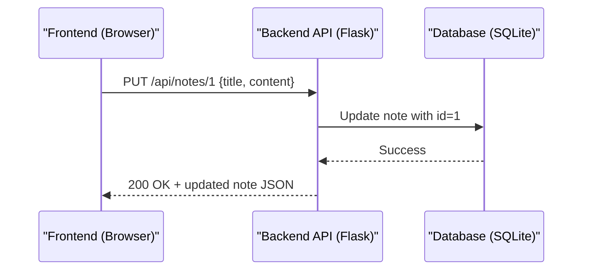
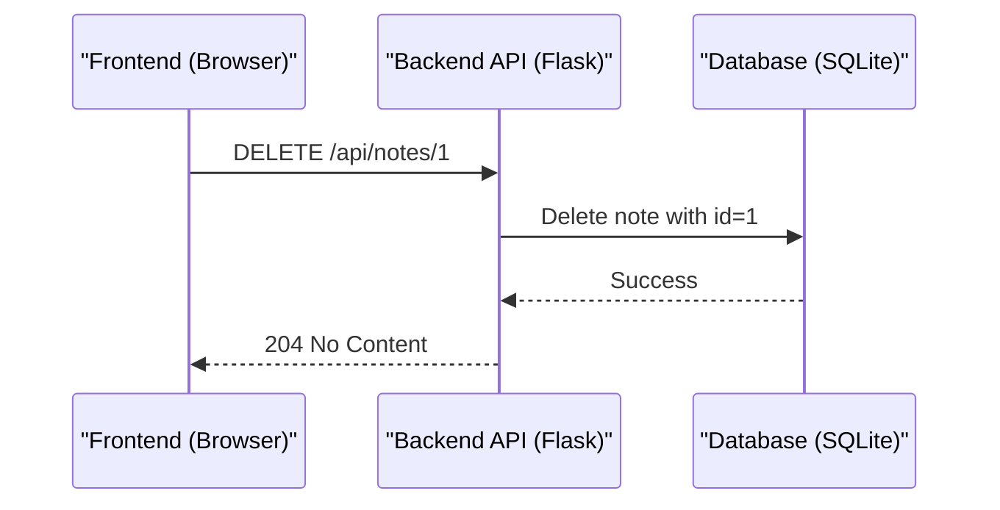

# Overview

The NoteTaking App is designed to help users easily create, edit, search, and manage personal notes in a modern, responsive web interface. It provides a simple way to organize thoughts, ideas, and information, making it ideal for students, professionals, and anyone who needs a digital notebook. The app supports full CRUD (Create, Read, Update, Delete) operations and real-time updates, ensuring your notes are always accessible and up-to-date.

# Architecture Overview

The app follows a classic web architecture with three main components:

- **Frontend**: The user interface that runs in your browser. It displays notes, handles user input, and communicates with the backend via HTTP requests.
- **Backend**: The server-side application built with Python and Flask. It processes requests from the frontend, performs business logic, and interacts with the database.
- **Database**: A persistent storage layer using SQLite, managed via SQLAlchemy ORM. It stores all notes and user data securely in a file.



### Tech Stack Used

- **Frontend**: HTML, CSS, JavaScript (static files served by Flask)
- **Backend**: Python 3.x, Flask, Flask-CORS
- **Database**: SQLite (file-based), SQLAlchemy (ORM), Flask-SQLAlchemy

## Project Folder Structure Explained

Here is an overview of the main folders and files in the NoteTaking App project:

```
notetaking-app/
├── README.md                # Project overview and instructions
├── .gitignore               # Git ignore file (which files/folders to exclude from version control)
├── requirements.txt         # Python dependencies for the app
├── src/                     # Main source code folder
│   ├── main.py              # Flask app entry point
│   ├── models/              # Database models (ORM classes)
│   │   ├── note.py          # Note model (represents notes table)
│   │   ├── user.py          # User model (represents users table)
│   ├── routes/              # API route definitions
│   │   ├── note.py          # Endpoints for notes (CRUD, search)
│   │   ├── user.py          # Endpoints for users (CRUD)
│   ├── static/              # Frontend static files (HTML, CSS, JS)
│   │   ├── index.html       # Main web page for the app
│   │   └── favicon.ico      # App icon
├── database/                # Database file storage
│   └── app.db               # SQLite database file
```

**Key components explained:**
- `src/main.py`: The Flask application entry point. This file starts the web server, sets up the database connection, registers API routes from blueprints, and serves static frontend files to browsers.
- `src/models/`: Contains Python classes that use SQLAlchemy ORM to define database table structures. Each class represents a table and its columns.
- `src/routes/`: Contains Flask blueprints that organize API endpoints into logical groups. Each file defines routes for a specific resource (notes, users).
-- `database/app.db`: The actual SQLite database file where all application data is stored persistently.
- `src/static/`: Contains the frontend files (HTML for structure, CSS for styling, JS for interactivity) that create the user interface.
- `requirements.txt`: Lists all Python packages needed to run the app, with specific versions to ensure consistency.
-- `requirements.txt`: Lists all Python packages needed to run the app, with specific versions to ensure consistency.
-- `.gitignore`: Specifies files and directories that Git should ignore, such as virtual environments and database files.


# Database

The NoteTaking App uses **SQLite** as its database, which stores all notes and user data in a single file (`database/app.db`).

## What is SQLAlchemy and how does it interact with the database?

**SQLAlchemy** is a Python library called an Object-Relational Mapper (ORM). Instead of writing SQL queries directly, you define Python classes (models) that represent tables in the database. SQLAlchemy translates your Python code into SQL commands behind the scenes.

An ORM (Object-Relational Mapper) is a library that maps between in-memory objects in your programming language and rows in a relational database table. This means you work with Python classes and objects (create, modify, delete) and the ORM turns those actions into SQL INSERT/UPDATE/DELETE/SELECT statements for you.

In SQLAlchemy a "model" is a Python class that inherits from `db.Model` and declares columns using `db.Column(...)`. Each model class maps to one database table. For example, the `Note` class in `src/models/note.py` is a model: each `Note` instance represents one row in the notes table, and the class attributes (`id`, `title`, `content`, `created_at`, `updated_at`) define the table's columns and types.

**How it works in this app:**
- You define models like `Note` and `User` in Python.
- When you add, update, or delete a model instance, SQLAlchemy automatically generates the correct SQL to interact with the SQLite database.
- On startup, `db.create_all()` creates tables if they don't exist.
- All database operations are handled in Python code, so you never need to write SQL directly.

**Note model example (`src/models/note.py`):**
```python
class Note(db.Model):
    id = db.Column(db.Integer, primary_key=True)  # Unique ID for each note
    title = db.Column(db.String(200), nullable=False)  # Title of the note (must be filled in)
    content = db.Column(db.Text, nullable=False)  # The actual note text (must be filled in)
    created_at = db.Column(db.DateTime, default=datetime.utcnow)  # When the note was created
    updated_at = db.Column(db.DateTime, default=datetime.utcnow, onupdate=datetime.utcnow)  # Last update time
```

**Explanation:**
- `class Note(db.Model)`: This line defines a new Python class called `Note` that inherits from `db.Model`. SQLAlchemy uses this to create a table called "note" in the database.
- `db.Column()`: Each of these creates a column in the database table. Think of columns as the different pieces of information you want to store about each note.
- `db.Integer`: Stores whole numbers (like 1, 2, 3). Used for the note's ID.
- `db.String(200)`: Stores text up to 200 characters long. Perfect for note titles.
- `db.Text`: Stores large amounts of text with no length limit. Used for the actual note content.
- `db.DateTime`: Stores date and time information (like "2025-09-04 14:30:25").
- `primary_key=True`: This column serves as the unique identifier for each row. No two notes can have the same ID.
- `nullable=False`: This field is required - you cannot create a note without providing this information.
- `default=datetime.utcnow`: When a new note is created, this field automatically gets set to the current date and time.
- `onupdate=datetime.utcnow`: Every time the note is modified and saved, this field automatically updates to the current time.

---

### Using the `Note` model (create / update / delete)

Here are small example snippets that show how to use the `Note` model with the SQLAlchemy session to create, update, and delete rows in the database. These examples assume you have `db` and `Note` imported from your application (as in `from src.models.note import Note` and `from src.main import db` or the appropriate module paths).

Brief note about `db` and `db.session`:
`db` is the Flask-SQLAlchemy object that wraps the database connection and configuration (usually created in `src/main.py`). `db.session` is the transactional session (unit of work) that tracks changes to model objects; use `db.session.add()`, `db.session.delete()`, and `db.session.commit()` to persist or remove changes in a single transaction.

Example initialization (where `db` is created and connected to the Flask app):

```python
# src/models/user.py
from flask_sqlalchemy import SQLAlchemy

db = SQLAlchemy()  # create the SQLAlchemy object used across models


# src/main.py (application setup)
from flask import Flask
from src.models.user import db

app = Flask(__name__)
app.config['SQLALCHEMY_DATABASE_URI'] = f"sqlite:///database/app.db"
app.config['SQLALCHEMY_TRACK_MODIFICATIONS'] = False

# bind the db object to the Flask app
db.init_app(app)

# create tables (run inside app context)
with app.app_context():
    db.create_all()
```

```python
# Create a new note and save it
note = Note(title="Buy groceries", content="Eggs, Milk, Bread")
db.session.add(note)
db.session.commit()

# Update an existing note (fetch, modify, commit)
note = Note.query.get(1)  # load note with id=1
if note:
    note.title = "Buy groceries (updated)"
    db.session.commit()

# Delete a note
note = Note.query.get(1)
if note:
    db.session.delete(note)
    db.session.commit()
```

These snippets show the typical lifecycle: create an object, add it to the session and commit; load an object, change attributes and commit; or delete an object and commit. SQLAlchemy translates these actions into the corresponding SQL statements for SQLite.


# REST API Endpoints

## What is HTTP REST?

**HTTP** is the protocol web browsers and servers use to communicate. **REST** (Representational State Transfer) is a way to design APIs that use standard HTTP methods (GET, POST, PUT, DELETE) to perform operations on resources (like notes).

## What is an API?

An **API** (Application Programming Interface) is a set of rules and endpoints that allow different software components to communicate. In this app, the API lets the frontend (browser) talk to the backend (server) to read, create, update, or delete notes.

The backend is built with **Flask** and exposes a RESTful API. The API endpoints are defined in `src/routes/note.py` and `src/routes/user.py`.

**Key endpoints for notes:**
- `GET /api/notes` — List all notes
- `POST /api/notes` — Create a new note
- `GET /api/notes/<id>` — Get a specific note
- `PUT /api/notes/<id>` — Update a note
- `DELETE /api/notes/<id>` — Delete a note
- `GET /api/notes/search?q=...` — Search notes

**Example endpoint (create note) from `src/routes/note.py`:**
```python
@note_bp.route('/notes', methods=['POST'])
def create_note():
    data = request.json  # Get the JSON data sent from the frontend
    note = Note(title=data['title'], content=data['content'])  # Create a new Note object
    db.session.add(note)  # Add the note to the database session
    db.session.commit()  # Save the changes to the database
    return jsonify(note.to_dict()), 201  # Return the created note as JSON with 201 status
```

**Code explanation:**
- `@note_bp.route('/notes', methods=['POST'])`: This decorator tells Flask that when someone sends a POST request to `/api/notes`, this function should handle it.
- `data = request.json`: Extracts the JSON data (title and content) that the frontend sent in the request body.
- `Note(title=data['title'], content=data['content'])`: Creates a new Note object using the title and content from the request. The ID and timestamps are set automatically.
- `db.session.add(note)`: Adds the new note to the database session (like putting it in a temporary holding area).
- `db.session.commit()`: Actually saves the note to the database file. Without this, the note would be lost.
- `return jsonify(note.to_dict()), 201`: Converts the note object to JSON format and sends it back to the frontend along with HTTP status code 201 (Created).

**API response codes:**
- 200 OK — Success
- 201 Created — New resource created
- 204 No Content — Resource deleted
- 400 Bad Request — Invalid input
- 404 Not Found — Resource not found
- 500 Internal Server Error — Unexpected error

---

# How CRUD Operations Work: Sequence Diagrams

## Create Operation

This section explains what "Create" means in the app: how the browser sends a new note to the server, how the API validates and persists it, and how the database confirms the insertion. The sequence diagram and example payloads below show these steps.


**Request Example (JSON)**
```json
{
    "title": "Grocery list",
    "content": "Eggs, Milk, Bread"
}
```

**Response Example (JSON) — 201 Created**
```json
{
    "id": 1,
    "title": "Grocery list",
    "content": "Eggs, Milk, Bread",
    "created_at": "2025-09-04T14:30:25",
    "updated_at": "2025-09-04T14:30:25"
}
```
**Explanation:**
- **Step 1**: The user clicks "Create Note" in the browser and fills out the title and content.
- **Step 2**: The frontend JavaScript sends a POST request to `/api/notes` with the note data in JSON format.
- **Step 3**: The Flask backend receives the request, validates the data, and creates a new Note object.
- **Step 4**: The backend uses SQLAlchemy to insert the new note into the SQLite database.
- **Step 5**: The database confirms the insertion was successful.
- **Step 6**: The backend converts the created note to JSON and sends it back to the frontend with a 201 Created status code.
- **Step 7**: The frontend receives the response and updates the UI to show the new note.

---

## Read Operation

This section shows how the app reads data: the frontend requests note data from the API, the backend queries the database, and the results are returned as JSON for the UI to render. See the sequence and examples below.


**Request Example (HTTP)**
```http
GET /api/notes HTTP/1.1
Host: localhost:5001
```

**Response Example (JSON) — 200 OK**
```json
[
    {
        "id": 1,
        "title": "Grocery list",
        "content": "Eggs, Milk, Bread",
        "created_at": "2025-09-04T14:30:25",
        "updated_at": "2025-09-04T14:30:25"
    },
    {
        "id": 2,
        "title": "Project notes",
        "content": "Finish the report by Monday",
        "created_at": "2025-09-04T15:10:00",
        "updated_at": "2025-09-04T15:10:00"
    }
]
```
**Explanation:**
- **Step 1**: The user opens the app or clicks "Refresh" to see all their notes.
- **Step 2**: The frontend JavaScript sends a GET request to `/api/notes` (no data needed for reading).
- **Step 3**: The Flask backend receives the request and queries the database for all notes.
- **Step 4**: SQLAlchemy translates the request into a SQL SELECT query and executes it on the SQLite database.
- **Step 5**: The database returns all note records to the backend.
- **Step 6**: The backend converts the note objects to JSON format and sends them back with a 200 OK status.
- **Step 7**: The frontend receives the notes array and displays them in the user interface.

---

## Retrieve a single note

This section explains how to fetch a single note by its ID using the REST API.



Request Example (HTTP)
```http
GET /api/notes/1 HTTP/1.1
Host: localhost:5001
```

Response Example (JSON) — 200 OK
```json
{
  "id": 1,
  "title": "Grocery list",
  "content": "Eggs, Milk, Bread",
  "created_at": "2025-09-04T14:30:25",
  "updated_at": "2025-09-04T14:30:25"
}
```

If the requested note does not exist the API responds with 404 Not Found and a small error JSON, for example:

```json
{ "error": "Note not found" }
```

**Explanation:**
- **Step 1**: The frontend requests `/api/notes/<id>` with the desired note id.
- **Step 2**: The backend queries the database for that id using SQLAlchemy (or raw SQL).
- **Step 3**: If a row is returned, the backend converts it to JSON and returns 200 OK; otherwise it returns 404 Not Found.

---

## Update Operation

This section describes updating an existing note: the frontend sends the modified fields to the API, the backend applies changes via SQLAlchemy, and the database persists the update. The diagram and JSON examples illustrate this flow.


**Request Example (JSON)**
```json
{
    "title": "Grocery list (updated)",
    "content": "Eggs, Milk, Bread, Butter"
}
```

**Response Example (JSON) — 200 OK**
```json
{
    "id": 1,
    "title": "Grocery list (updated)",
    "content": "Eggs, Milk, Bread, Butter",
    "created_at": "2025-09-04T14:30:25",
    "updated_at": "2025-09-04T16:00:00"
}
```
**Explanation:**
- **Step 1**: The user edits an existing note (changes title or content) and clicks "Save".
- **Step 2**: The frontend sends a PUT request to `/api/notes/1` (where 1 is the note ID) with the updated data.
- **Step 3**: The Flask backend finds the note with ID 1 in the database.
- **Step 4**: The backend updates the note's fields with the new data and uses SQLAlchemy to save changes.
- **Step 5**: SQLAlchemy executes an UPDATE SQL query on the SQLite database.
- **Step 6**: The database confirms the update was successful.
- **Step 7**: The backend returns the updated note as JSON with a 200 OK status.
- **Step 8**: The frontend updates the UI to show the modified note with its new content.

---

## Delete Operation

This section covers deleting a note: the frontend asks the API to remove a resource, the backend deletes it from the database, and the API returns confirmation (usually no content). See the diagram and request/response examples below.


**Request Example (HTTP)**
```http
DELETE /api/notes/1 HTTP/1.1
Host: localhost:5001
```

**Response Example — 204 No Content**
```
(No body in response)
```
**Explanation:**
- **Step 1**: The user clicks the "Delete" button next to a note (or selects delete from a menu).
- **Step 2**: The frontend sends a DELETE request to `/api/notes/1` (where 1 is the note ID to delete).
- **Step 3**: The Flask backend finds the note with ID 1 in the database.
- **Step 4**: The backend uses SQLAlchemy to delete the note from the database.
- **Step 5**: SQLAlchemy executes a DELETE SQL query on the SQLite database.
- **Step 6**: The database confirms the deletion was successful and the note no longer exists.
- **Step 7**: The backend returns a 204 No Content status (meaning "success, but no data to return").
- **Step 8**: The frontend removes the note from the UI, so it disappears from the user's view.

The frontend is a single-page web app built with these technologies. It is served as static files from the backend (`src/static/index.html`).

**How it works:**
- When you open the app in your browser, you see the UI from `index.html`.
- The frontend uses JavaScript to send HTTP requests to the backend API to fetch, create, update, or delete notes.
- All changes are reflected instantly in the browser.

**Frontend file location:**
- `src/static/index.html` (main web page)


# Client-Side Code (Frontend)


The frontend is the part of the app you interact with in your browser. Its main job is to present notes to the user, accept input (search, create, edit, delete), and keep the UI in sync with the backend server. It runs entirely in the browser and is served from `src/static/index.html`.

**Features implemented by the frontend:**

- List notes and show a preview and last-updated time.
- Search notes in the browser (client-side filtering).
- Create new notes and edit existing ones (title + content).
- Delete notes.
- Simple validation to avoid saving empty notes.
- Auto-save while typing (debounced) to reduce data loss.
- User messages for success and error states.


The frontend uses the browser's Fetch API to call the Flask REST endpoints. It sends and receives JSON and updates the page dynamically without reloading.


The following code snippets illustrate how the frontn end obtains the list of notes using HTTP GET method.

```javascript
const response = await fetch('/api/notes');
this.notes = await response.json();
this.renderNotesList();
```

The frontend will use the fetch to sends HTTP `POST` and `PUT` requests to the backend AP to create and update the notes.

```javascript
const noteData = { title: '...', content: '...' };
// create
await fetch('/api/notes', { method: 'POST', headers: {'Content-Type':'application/json'}, body: JSON.stringify(noteData) });
// update
await fetch(`/api/notes/${id}`, { method: 'PUT', headers: {'Content-Type':'application/json'}, body: JSON.stringify(noteData) });
```

Meanwhile, to delete a note, the frontend sends an HTTP `DELETE` request to the backend API:

```javascript
await fetch(`/api/notes/${id}`, { method: 'DELETE' });
```
